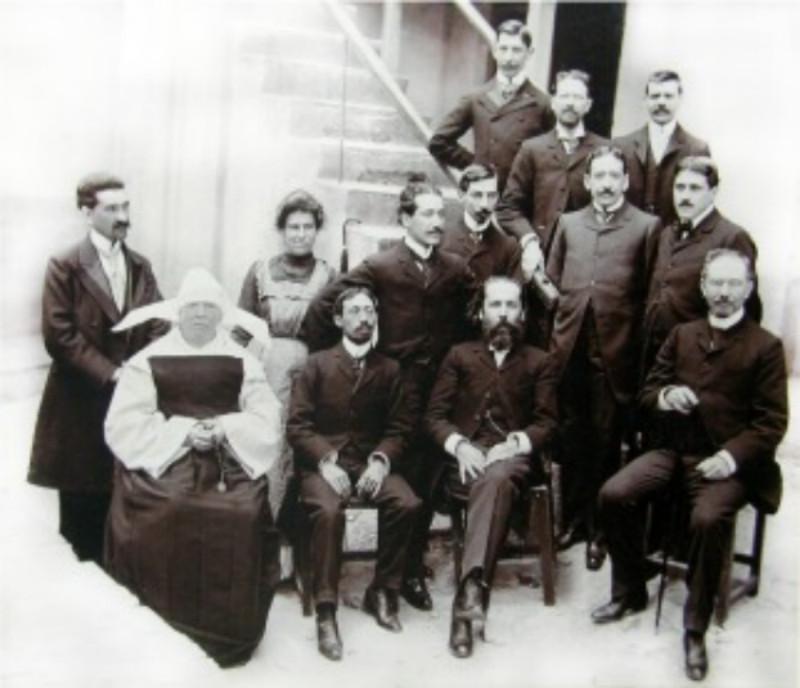
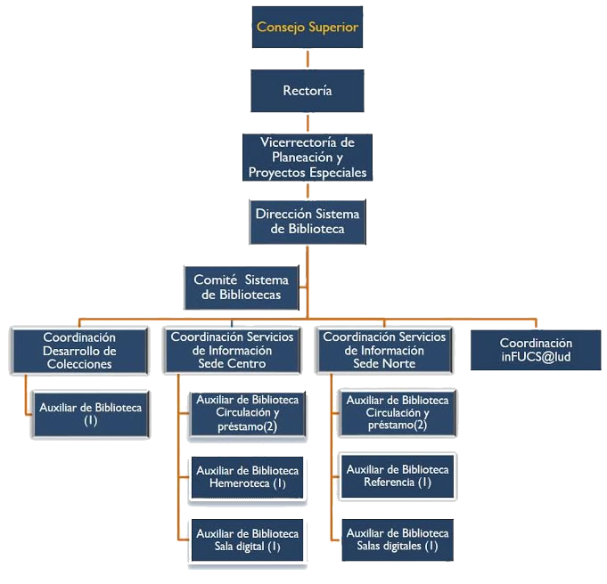
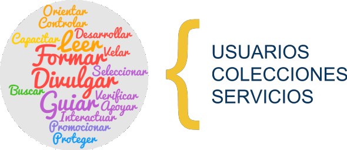

fecha de creación: 11 de marzo de 2018

ultima actualización: 07 de marzo de 2020

<!-- TOC -->

- [Modificación manual de bienvenida](#modificaci%c3%b3n-manual-de-bienvenida)
  - [introducción](#introducci%c3%b3n)
  - [HTML](#html)
    - [Ejemplos  de HTML](#ejemplos-de-html)
      - [Crear un documento HTML](#crear-un-documento-html)
        - [Pasos para crear un archivo HTML](#pasos-para-crear-un-archivo-html)
      - [Cuerpo de un documento HTML](#cuerpo-de-un-documento-html)
      - [Titulos](#titulos)
        - [Titulos de primer nivel](#titulos-de-primer-nivel)
        - [Titulos de segundo nivel y otros](#titulos-de-segundo-nivel-y-otros)
      - [Párrafos](#p%c3%a1rrafos)
      - [Énfasis](#%c3%89nfasis)
      - [Listas no ordenadas](#listas-no-ordenadas)
      - [Bloques de elementos](#bloques-de-elementos)
      - [comentarios](#comentarios)
  - [CSS](#css)
    - [Para empezar](#para-empezar)
    - [Atributo color](#atributo-color)
      - [Color en los enlaces](#color-en-los-enlaces)
      - [Espaciado entre líneas](#espaciado-entre-l%c3%adneas)
      - [Espaciado entre caracteres](#espaciado-entre-caracteres)
      - [Enlaces sin subrayado](#enlaces-sin-subrayado)
    - [Incluir estilos para todo un sitio web](#incluir-estilos-para-todo-un-sitio-web)
    - [CSS tienen mucho más](#css-tienen-mucho-m%c3%a1s)
  - [JavaScript](#javascript)
    - [Sintaxis](#sintaxis)
    - [Comentrios](#comentrios)
      - [Comentario de una sola línea](#comentario-de-una-sola-l%c3%adnea)
      - [Comentario de varias líneas](#comentario-de-varias-l%c3%adneas)
    - [Programación básica](#programaci%c3%b3n-b%c3%a1sica)
      - [Variables](#variables)
      - [Tipos de variables](#tipos-de-variables)
        - [Numéricas](#num%c3%a9ricas)
        - [Cadenas de texto](#cadenas-de-texto)
        - [Arrays](#arrays)
        - [Booleanos](#booleanos)
  - [Resumiendo lo básico](#resumiendo-lo-b%c3%a1sico)
- [Estructura del manual](#estructura-del-manual)
  - [Ver el manual](#ver-el-manual)
  - [Editar el archivo ***index.html***](#editar-el-archivo-indexhtml)
  - [Estructura del manual](#estructura-del-manual-1)
  - [Editar la cabecera](#editar-la-cabecera)
    - [Editar el titulo del documento](#editar-el-titulo-del-documento)
  - [Editar el menú](#editar-el-men%c3%ba)
  - [Editar sección de bienvenida](#editar-secci%c3%b3n-de-bienvenida)
  - [Editar sección Grupo San josé](#editar-secci%c3%b3n-grupo-san-jos%c3%a9)
  - [Editar sección ubicación](#editar-secci%c3%b3n-ubicaci%c3%b3n)
  - [Editar sección sistemas de bibliotecas](#editar-secci%c3%b3n-sistemas-de-bibliotecas)
  - [Editar sección tips](#editar-secci%c3%b3n-tips)
  - [Editar subsecciones](#editar-subsecciones)
    - [Subsección miembros del consejo](#subsecci%c3%b3n-miembros-del-consejo)
    - [Editar sección valores y competencias organizacionales](#editar-secci%c3%b3n-valores-y-competencias-organizacionales)
- [Conclusiones y recomendaciones](#conclusiones-y-recomendaciones)

<!-- /TOC -->

# Modificación manual de bienvenida #

En este documento encontrarás la información necesaria para realizar cambios en el contenido del manual de bienvenida de la biblioteca de la fundación universitaria San José, es indispensable que la persona que modifique el manual tenga un conocimiento básico sobre el desarrollo web

## introducción ##

El manual que da la bienvenida a los nuevos miembros de la biblioteca está elaborado con tecnologías web y puedes consultarlo desde [https://kiryeelesion.github.io/Manual][l1].

Lo primero a tener en cuenta son los conceptos básicos del desarrollo web por lo que veremos una breve introducción de las tecnologías usadas para la elaboración del manual 

## HTML ##

HTML es un lenguaje de marcado sus siglas significan ***HyperText Markup Language*** (lenguaje de marcas de hipertexto), creado por Tim Berners-Lee considerado el padre de la web.

HTML se escribe en forma de «etiquetas», rodeadas por corchetes angulares `< >`. El HTML también puede describir, hasta un cierto punto, la apariencia de un documento, y puede incluir o hacer referencia a un tipo de programa llamado script, el cual puede afectar el comportamiento de navegadores web y otros procesadores de HTML. Veamos unos ejemplos para entender.

### Ejemplos  de HTML ###

#### Crear un documento HTML ####

Crear un documento HTML es tan sencillo como crear una nota con el bloc de notas, con la diferencia de la extensión, el archivo debe guardarse como ***.html*** es decir imaginemos que creamos un archivo con el nombre *index* que contendrá el código HTML, el archivo quedara nombrado como ***index.html***

##### Pasos para crear un archivo HTML #####

Primero debemos crear una carpeta donde guardaremos los archivos y dentro de esta carpeta realizaremos los siguientes pasos:

1. Crear un archivo de texto dando clic derecho en un área vaciá de la carpeta.  
![Crear archivo HTML][i1]

2. Guardar con el nombre index.html     
![Asignar nombre al archivo][i2]

Ahora tendremos un archivo como el siguiente:

![Archivo HTML][i3]

#### Cuerpo de un documento HTML ####

Todo documento HTML tiene una estructura que debe respetarse y define el cuerpo de un documento, debe ser la siguiente:

~~~html
<!DOCTYPE html>
<html>
    <head>
        <meta charset="UTF-8">
        <meta name="viewport" content="width=device-width, initial-scale=1.0">
        <meta http-equiv="X-UA-Compatible" content="ie=edge">
    <title>Document</title>
    </head>
    <body>
    
    </body>
</html>
~~~

El anterior contenido estará dentro del archivo html en este caso dentro del *index.html*, si damos doble clic sobre el archivo observaremos que se abre el navegador internet y nos mostrara una pagina en blanco

![Navegador WEB][i4]

Si observamos detenidamente veremos que en el titulo de la pestaña vemos el texto *Document* que corresponde a la etiqueta `<title>`.

Entendamos un poco mejor el código anterior:

`<!DOCTYPE html>`: Esta declaración siembre debe ser ir en la primera linea en el código HTML, como tal esta declaración no es una etiqueta del lenguaje HTML, es una instrucción para el navegador web en la cual se le informa en que versión de HTML esta escrito el documento. 

`<html>`: representa la raíz del documento HTML y se define como el contenedor de todas las etiquetas HTML, cada etiqueta en HTML se cierra salvo algunos casos especiales, la etiqueta de cierre es`</html>`.

`<head>`: esta etiqueta contiene todos los elementos de la cabecera del documento, que incluyen un titulo para el documento, scritps, estilos, metadatos entre otros, su etiqueta de cierre es `</head>`

`<title>`: Esta etiqueta es requerida en todos los documentos HTML y define el titulo para el documento, su etiqueta de cierre es `</title>`.

`<body>`: Es la etiqueta mas importante, por que define el cuepro de un documento HTML y todos los elementos que debe contener como texto, hyperlinks, imágenes, tablas, listas entre otros, su etiqueta de cierre es `</body>`.

#### Titulos ####

##### Titulos de primer nivel #####

Para crear un titulo de primer orden se puede usar la etiqueta `<h1>`, por ejemplo:

~~~html
<h1>Manual</h1>
~~~
Al recargar la pagina tendríamos lo siguiente:

![titulo][i5]

##### Titulos de segundo nivel y otros #####

Para crear titulos de segundo nivel se usa la etiqueta `<h2>`, ejemplo:

~~~html
<h2>Bienvenidos.</h2>
~~~  

Al recargar la pagina tendríamos lo siguiente:

![titulo de segundo nivel][i6]

Para realizar titulos de siguientes niveles podemos usar etiquetas como:

+ `h3` para titulos de tercer nivel
+ `h4` para titulos de cuarto nivel
+ `h5` para titulos de quinto nivel
+ `h6` para titulos de sexto nivel

#### Párrafos ####

Para crear un párrafo se usa la etiqueta `
`, ejemplo:

~~~html

 El beneficio que genera compartir cultura sin limitación es un exiliado en los medios de masas y en las agendas de los gobiernos. Nada o menos que nada importa el hecho de que millones de ciudadanos tengan hoy un acceso a la cultura que hasta ayer solo soñaban. Que se pida que el interés privado no aplaste al interés general o que las empresas se adapten o sometan a esta nueva realidad es un delirio propio de piratas. 

~~~

Al recargar la pagina tendríamos lo siguiente:

![párrafo][i7]

#### Énfasis ####

Podemos usar etiquetas para resaltar texto dentro de un párrafo:

+ `<strong>`: Es la negrilla en la letra.
+  `<em>`: Es un énfasis de texto.

Pensemos que en el párrafo anterior queremos poner en negrilla la palabra *beneficio*, poner en énfasis *millodes de ciudadanos* y entre negrilla y énfasis *piratas*.

Quedaría de la siguiente forma:

~~~html

 El <strong> beneficio </strong>que genera compartir cultura sin limitación es un exiliado en los medios de masas y en las agendas de los gobiernos. Nada o menos que nada importa el hecho de que <em> millones de ciudadanos</em> tengan hoy un acceso a la cultura que hasta ayer solo soñaban. Que se pida que el interés privado no aplaste al interés general o que las empresas se adapten o sometan a esta nueva realidad es un delirio propio de <strong><em>piratas</em></strong>. 

~~~

Al recargar la pagina veríamos lo siguiente: 

![énfasis][i8]

#### Listas no ordenadas ####

Las listas no ordenadas son las más sencillas y las que más se utilizan. Una lista no ordenada es un conjunto de elementos relacionados entre sí pero para los que no se indica un orden o secuencia determinados. La etiqueta `<ul>` encierra todos los elementos de la lista y la etiqueta `<li>` cada uno de sus elementos.

Ejemplo:

~~~html
<ul>
    <li>item 1</li>
    <li>item 2</li>
    <li>item 3</li>
    <li>item 4</li>
</ul>
~~~

Al recargar la pagina veríamos lo siguiente: 

![listas no ordenadas][i9]

#### Bloques de elementos ####

En ocasiones necesitamos organizar nuestro documento, y dividirlo en secciones o bloques, para esto existe la etiqueta `
`, por ejemplo queremos organizar el actual documento que estamos trabajando teniendo en un bloque el párrafo y en otro la lista.

~~~html

    
 El <strong> beneficio </strong>que genera compartir cultura sin limitación es un exiliado en los medios de masas y en las agendas de los gobiernos. Nada o menos que nada importa el hecho de que <em> millones de ciudadanos</em> tengan hoy un acceso a la cultura que hasta ayer solo soñaban. Que se pida que el interés privado no aplaste al interés general o que las empresas se adapten o sometan a esta nueva realidad es un delirio propio de <strong><em>piratas</em></strong>. 

    <ul>
        <li>item 1</li>
        <li>item 2</li>
        <li>item 3</li>
        <li>item 4</li>
    </ul>

~~~

Si recargamos la página, no veríamos ningún cambio ya que la etiqueta div no es un elemento gráfico. solo sirve para organizar nuestro código.

#### comentarios ####

Los comentarios sirven para documentar el código en el que se esta trabajando, son muy útiles al momento de consultar el código de otra persona.

Un comentario luce de la siguiente forma

~~~html
<!-- esto es un comentario -->
~~~

lo que esta escrito dentro de `<!-- -->` al momento de recargar la pagina no se visualizara en el navegador.

En conclusión HTML sirve para estructurar la información contenida en una página. ***Es recomendable que la persona que modifique el manual como mínimo realice el tutorial de HTML que puedes consultar en la documentación oficial***, en el siguiente [enlace][l2].

## CSS ##

CSS, es una tecnología que nos permite crear páginas web de una manera más exacta. Gracias a las CSS somos mucho más dueños de los resultados finales de la página, pudiendo hacer muchas cosas que no se puede hacer utilizando solamente HTML, como incluir márgenes, tipos de letra, fondos, colores...

CSS son las siglas de Cascading Style Sheets, en español Hojas de estilo en Cascada. En este documento vamos a ver algunos de los efectos que se pueden crear con las CSS sin necesidad de conocer la tecnología entera.

### Para empezar ###

Las Hojas de Estilo en Cascada se escriben dentro del código HTML de la página web, solo en casos avanzados se pueden escribir en un archivo a parte y enlazar la página con ese archivo (como es el caso del manual de bienvenida). En un principio vamos a utilizar la manera más directa de aplicar estilos a los elementos de la página. Para ello, vamos a conocer un nuevo atributo que se puede utilizar en casi todas las etiquetas HTML: style.

Ejemplo:

Dentro del atributo style se deben indicar los atributos de estilos CSS separados por punto y coma (;).

### Atributo color ###

color: indica el color del contenido la etiqueta donde estemos utilizándolo, generalmente indica el color del texto.
font-weight: indica el grosor del texto. Bold sirve para poner en negrita.

#### Color en los enlaces ####

Con HTML definimos el color de los enlaces en la etiqueta `<body>`, con lo atributos link, vlink y alink. Esto nos permite cambiar el color de los enlaces para todo el documento, pero ¿Y si queremos cambiar el color de un enlace en concreto, para que tenga otro color que el definido en la etiqueta `<body>`?

Para hacer esto utilizaremos el atributo style dentro del enlace:

~~~html
<a href="mienlace.html" style="color:red">
~~~

Así saldrá el enlace en color rojo, independientemente de lo definido para todo el documento.

#### Espaciado entre líneas ####

Con CSS podemos definir el espacio que hay entre cada línea del documento, utilizando el atributo line-height. Por ejemplo, podemos definir que para todo un párrafo el espacio entre cada una de sus líneas sea 25 pixels:

~~~html

Un párrafo normal en el que cada una de las líneas está separada 25 pixels de la otra. Hay que poner suficiente texto como para que se vean 2 líneas, así saldrán separadas

~~~

#### Espaciado entre caracteres ####

Se puede definir también el espacio entre cada carácter. Esto se hace con el atributo de CSS letter-spacing. Veamos un ejemplo:

~~~html

 
Este párrafo tiene las letras espaciadas por 1 centímetro. 

~~~

#### Enlaces sin subrayado ####

Uno de los efectos más significativos y fáciles de realizar con CSS es eliminar el subrayado de los enlaces de una página web. Existe un atributo que sirve para definir la decoración de un texto, si está subrayado, tachado, o si no tiene ninguna de estas "decoraciones". Es el atributo text-decoration, en este caso indicaremos en un enlace que no queremos decoración:

~~~html
<a href="mipagina.html" style="text-decoration:none">
~~~

### Incluir estilos para todo un sitio web ###

Una de las características más potentes de la programación con hojas de estilo consiste en definir los estilos de todo un sitio web. Esto se consigue creando un archivo donde tan sólo colocamos las declaraciones de estilos de la página y enlazando todas las páginas del sitio con ese archivo. De este modo, todas las páginas comparten una misma declaración de estilos y, por tanto, si la cambiamos, cambiarán todas las páginas.

Veamos ahora todo el proceso para incluir estilos con un fichero externo.

1. Creamos el fichero con la declaración de estilos

Es un fichero de texto normal, que puede tener cualquier extensión, aunque le podemos asignar la extensión .css para aclararnos qué tipo de archivo es. El texto que debemos incluir debe ser escrito exclusivamente en sintaxis CSS, es un poco distinta que la sintaxis que utilizamos dentro del atributo style. Sería erróneo incluir código HTML en este archivo: etiquetas y demás. Podemos ver un ejemplo a continuación.

~~~css
P { 
font-size : 12pt; 
font-family : arial,helvetica; 
font-weight : normal; 
} 
H1 { 
font-size : 36pt; 
font-family : verdana,arial; 
text-decoration : underline; 
text-align : center; 
background-color : Teal; 
} 
BODY { 
background-color : #006600; 
font-family : arial; 
color : White; 
}
~~~

2. Enlazamos la página web con la hoja de estilos

Para ello vamos a colocar la etiqueta `<LINK>` con los atributos:

*rel="STYLESHEET"* indicando que el enlace es con una hoja de estilo.

*type="text/css"* porque el archivo es de texto, en sintaxis CSS.

*href="estilos.css"* indica el nombre del fichero fuente de los estilos.

Veamos una página web entera que enlaza con la declaración de estilos anterior:

~~~html
<html> 
    <head> 
        <link rel="STYLESHEET" type="text/css" href="estilos.css"> 
        <title>Página que lee estilos</title> 
    </head> 
    <body> 
        <h1>Página que lee estilos</h1> 
        
 
            Esta página tiene en la cabecera la etiqueta necesaria para enlazar con la hoja de estilos. Es muy fácil. 
        
 
    </body> 
</html>
~~~
### CSS tienen mucho más ###

Las Hojas de Estilo en Cascada son un estándar muy amplio, con unas especificaciones y posibilidades muy grandes. En este documento hemos visto unos cuantos efectos interesantes que realizar aunque no tengamos ningún conocimiento previo. Sin embargo, lo mejor para trabajar con esta tecnología es conocerla bien, gracias a ello, los resultados serán mucho más sorprendentes. ***La persona que modifique el manual como mínimo debería realizar el tutorial*** que puedes consultar [aquí][l3].

## JavaScript ##

JavaScript es un lenguaje de programación que se utiliza principalmente para crear páginas web dinámicas.

Una página web dinámica es aquella que incorpora efectos como texto que aparece y desaparece, animaciones, acciones que se activan al pulsar botones y ventanas con mensajes de aviso al usuario.

Técnicamente, JavaScript es un lenguaje de programación interpretado, por lo que no es necesario compilar los programas para ejecutarlos. En otras palabras, los programas escritos con JavaScript se pueden probar directamente en cualquier navegador sin necesidad de procesos intermedios.

### Sintaxis ###

La sintaxis de un lenguaje de programación se define como el conjunto de reglas que deben seguirse al escribir el código fuente de los programas para considerarse como correctos para ese lenguaje de programación.

La sintaxis de JavaScript es muy similar a la de otros lenguajes de programación como Java y C. Las normas básicas que definen la sintaxis de JavaScript son las siguientes:

+ **No se tienen en cuenta los espacios en blanco y las nuevas líneas:** como sucede con HTML, el intérprete de JavaScript ignora cualquier espacio en blanco sobrante, por lo que el código se puede ordenar de forma adecuada para entenderlo mejor (tabulando las líneas, añadiendo espacios, creando nuevas líneas, etc.)

+ **Se distinguen las mayúsculas y minúsculas:** al igual que sucede con la sintaxis de las etiquetas y elementos HTML. Sin embargo, si en una página HTML se utilizan indistintamente mayúsculas y minúsculas, la página se visualiza correctamente, siendo el único problema la no validación de la página. En cambio, si en JavaScript se intercambian mayúsculas y minúsculas el script no funciona.

+ **No se define el tipo de las variables:** al crear una variable, no es necesario indicar el tipo de dato que almacenará. De esta forma, una misma variable puede almacenar diferentes tipos de datos durante la ejecución del script.

+ **No es necesario terminar cada sentencia con el carácter de punto y coma (;):** en la mayoría de lenguajes de programación, es obligatorio terminar cada sentencia con el carácter ;. Aunque JavaScript no obliga a hacerlo, es conveniente seguir la tradición de terminar cada sentencia con el carácter del punto y coma (;).

+ **Se pueden incluir comentarios:** los comentarios se utilizan para añadir información en el código fuente del programa. Aunque el contenido de los comentarios no se visualiza por pantalla, si que se envía al navegador del usuario junto con el resto del script, por lo que es necesario extremar las precauciones sobre la información incluida en los comentarios.

### Comentrios ###

JavaScript define dos tipos de comentarios: los de una sola línea y los que ocupan varias líneas.

#### Comentario de una sola línea ####

~~~js
// a continuación se muestra un mensaje
alert("mensaje de prueba");
~~~

Los comentarios de una sola línea se definen añadiendo dos barras oblicuas `//` al principio de la línea.

#### Comentario de varias líneas ####

~~~js
/* Los comentarios de varias líneas son muy útiles
cuando se necesita incluir bastante información
en los comentarios */
alert("mensaje de prueba");
~~~

Los comentarios multilínea se definen encerrando el texto del comentario entre los símbolos `/*` y `*/`.

### Programación básica ###

Antes de comenzar a desarrollar programas y utilidades con JavaScript, es necesario conocer los elementos básicos con los que se construyen las aplicaciones. Si ya sabes programar en algún lenguaje de programación, este capítulo te servirá para conocer la sintaxis específica de JavaScript.

Si nunca has programado, este capítulo explica en detalle y comenzando desde cero los conocimientos básicos necesarios para poder entender posteriormente la programación avanzada, que es la que se utiliza para crear las aplicaciones reales.

#### Variables ####

Las variables en los lenguajes de programación siguen una lógica similar a las variables utilizadas en otros ámbitos como las matemáticas. Una variable es un elemento que se emplea para almacenar y hacer referencia a otro valor. Gracias a las variables es posible crear "programas genéricos", es decir, programas que funcionan siempre igual independientemente de los valores concretos utilizados.

De la misma forma que si en Matemáticas no existieran las variables no se podrían definir las ecuaciones y fórmulas, en programación no se podrían hacer programas realmente útiles sin las variables.

Si no existieran variables, un programa que suma dos números podría escribirse como:

~~~js
resultado = 3 + 1
~~~

El programa anterior es tan poco útil que sólo sirve para el caso en el que el primer número de la suma sea el 3 y el segundo número sea el 1. En cualquier otro caso, el programa obtiene un resultado incorrecto.

Sin embargo, el programa se puede rehacer de la siguiente manera utilizando variables para almacenar y referirse a cada número:

~~~js
numero_1 = 3
numero_2 = 1
resultado = numero_1 + numero_2
~~~

Los elementos `numero_1` y `numero_2` son **variables** que almacenan los valores que utiliza el programa. El resultado se calcula siempre en función del valor almacenado por las variables, por lo que este programa funciona correctamente para cualquier par de números indicado. Si se modifica el valor de las variables `numero_1` y `numero_2`, el programa sigue funcionando correctamente.

Las variables en JavaScript se crean mediante la palabra reservada `var`. De esta forma, el ejemplo anterior se puede realizar en JavaScript de la siguiente manera:

~~~js
var numero_1 = 3;
var numero_2 = 1;
var resultado = numero_1 + numero_2;
~~~

La palabra reservada var solamente se debe indicar al definir por primera vez la variable, lo que se denomina ***declarar*** una variable. Cuando se utilizan las variables en el resto de instrucciones del script, solamente es necesario indicar su nombre. En otras palabras, en el ejemplo anterior sería un error indicar lo siguiente:

~~~js
var numero_1 = 3;
var numero_2 = 1;
var resultado = var numero_1 + var numero_2;
~~~

Si cuando se declara una variable se le asigna también un valor, se dice que la variable ha sido ***inicializada***. En JavaScript no es obligatorio inicializar las variables, ya que se pueden declarar por una parte y asignarles un valor posteriormente. Por tanto, el ejemplo anterior se puede rehacer de la siguiente manera:

~~~js
var numero_1;
var numero_2;
 
numero_1 = 3;
numero_2 = 1;
 
var resultado = numero_1 + numero_2;
~~~

Una de las características más sorprendentes de JavaSript para los programadores habituados a otros lenguajes de programación es que tampoco es necesario declarar las variables. En otras palabras, se pueden utilizar variables que no se han definido anteriormente mediante la palabra reservada var. El ejemplo anterior también es correcto en JavaScript de la siguiente forma:

~~~js
var numero_1 = 3;
var numero_2 = 1;
resultado = numero_1 + numero_2;
~~~

La variable resultado no está declarada, por lo que JavaScript crea una variable global (más adelante se verán las diferencias entre variables locales y globales) y le asigna el valor correspondiente. De la misma forma, también sería correcto el siguiente código:

~~~js
numero_1 = 3;
numero_2 = 1;
resultado = numero_1 + numero_2;
~~~

En cualquier caso, se recomienda declarar todas las variables que se vayan a utilizar.

El nombre de una variable también se conoce como **identificador** y debe cumplir las siguientes normas:

+ Sólo puede estar formado por letras, números y los símbolos $ (dólar) y _ (guión bajo).

+ El primer carácter no puede ser un número.

Por tanto, las siguientes variables tienen nombres correctos:

~~~js
var $numero1;
var _$letra;
var $$$otroNumero;
var $_a__$4;
~~~

Sin embargo, las siguientes variables tienen identificadores incorrectos:

~~~js
var 1numero;       // Empieza por un número
var numero;1_123;  // Contiene un carácter ";"
~~~

#### Tipos de variables ####

Aunque todas las variables de JavaScript se crean de la misma forma (mediante la palabra reservada `var`), la forma en la que se les asigna un valor depende del tipo de valor que se quiere almacenar (números, textos, etc.)

##### Numéricas #####

Se utilizan para almacenar valores numéricos enteros (llamados *integer* en inglés) o decimales (llamados *float* en inglés). En este caso, el valor se asigna indicando directamente el número entero o decimal. Los números decimales utilizan el carácter `.` (punto) en vez de `,` (coma) para separar la parte entera y la parte decimal:

~~~js
var iva = 16;        // variable tipo entero
var total = 234.65;  // variable tipo decimal
~~~

##### Cadenas de texto #####

Se utilizan para almacenar caracteres, palabras y/o frases de texto. Para asignar el valor a la variable, se encierra el valor entre comillas dobles o simples, para delimitar su comienzo y su final:

~~~js
var mensaje = "Bienvenido a nuestro sitio web";
var nombreProducto = 'Producto ABC';
var letraSeleccionada = 'c';
~~~

En ocasiones, el texto que se almacena en las variables no es tan sencillo. Si por ejemplo el propio texto contiene comillas simples o dobles, la estrategia que se sigue es la de encerrar el texto con las comillas (simples o dobles) que no utilice el texto:

~~~js
/* El contenido de texto1 tiene comillas simples, por lo que se encierra con comillas dobles */
var texto1 = "Una frase con 'comillas simples' dentro";
 
/* El contenido de texto2 tiene comillas dobles, por lo que se encierra con comillas simples */
var texto2 = 'Una frase con "comillas dobles" dentro';
~~~

No obstante, a veces las cadenas de texto contienen tanto comillas simples como dobles. Además, existen otros caracteres que son difíciles de incluir en una variable de texto (tabulador, ENTER, etc.) Para resolver estos problemas, JavaScript define un mecanismo para incluir de forma sencilla caracteres especiales y problemáticos dentro de una cadena de texto.

El mecanismo consiste en sustituir el carácter problemático por una combinación simple de caracteres. A continuación se muestra la tabla de conversión que se debe utilizar:

| Si se quiere incluir... |	Se debe incluir... |
|-------------------------|--------------------|
| Una nueva línea         |	 \n                |
| Un tabulador            |  \t                |
| Una comilla simple 	  |  \'                |
| Una comilla doble       |  \"                |
| Una barra inclinada     | \\                 |

De esta forma, el ejemplo anterior que contenía comillas simples y dobles dentro del texto se puede rehacer de la siguiente forma:

~~~js
var texto1 = 'Una frase con \'comillas simples\' dentro';
 
var texto2 = "Una frase con \"comillas dobles\" dentro";
~~~

Este mecanismo de JavaScript se denomina "mecanismo de escape" de los caracteres problemáticos, y es habitual referirse a que los caracteres han sido "escapados".

##### Arrays #####

En ocasiones, a los arrays se les llama vectores, matrices e incluso arreglos. No obstante, el término array es el más utilizado y es una palabra comúnmente aceptada en el entorno de la programación.

Un array es una colección de variables, que pueden ser todas del mismo tipo o cada una de un tipo diferente. Su utilidad se comprende mejor con un ejemplo sencillo: si una aplicación necesita manejar los días de la semana, se podrían crear siete variables de tipo texto:

~~~js
var dia1 = "Lunes";
var dia2 = "Martes";
...
var dia7 = "Domingo";
~~~

Aunque el código anterior no es incorrecto, sí que es poco eficiente y complica en exceso la programación. Si en vez de los días de la semana se tuviera que guardar el nombre de los meses del año, el nombre de todos los países del mundo o las mediciones diarias de temperatura de los últimos 100 años, se tendrían que crear decenas o cientos de variables.

En este tipo de casos, se pueden agrupar todas las variables relacionadas en una colección de variables o array. El ejemplo anterior se puede rehacer de la siguiente forma:

~~~js
var dias = ["Lunes", "Martes", "Miércoles", "Jueves", "Viernes", "Sábado", "Domingo"];
~~~

Ahora, una única variable llamada dias almacena todos los valores relacionados entre sí, en este caso los días de la semana. Para definir un array, se utilizan los caracteres `[` y `]` para delimitar su comienzo y su final y se utiliza el carácter `,` (coma) para separar sus elementos:

~~~js
var nombre_array = [valor1, valor2, ..., valorN];
~~~

Una vez definido un array, es muy sencillo acceder a cada uno de sus elementos. Cada elemento se accede indicando su posición dentro del array. La única complicación, que es responsable de muchos errores cuando se empieza a programar, es que las posiciones de los elementos empiezan a contarse en el `0` y no en el `1`:

~~~js
var diaSeleccionado = dias[0];    // diaSeleccionado = "Lunes"
var otroDia = dias[5];            // otroDia = "Sábado"
~~~

En el ejemplo anterior, la primera instrucción quiere obtener el primer elemento del array. Para ello, se indica el nombre del array y entre corchetes la posición del elemento dentro del array. Como se ha comentado, las posiciones se empiezan a contar en el `0`, por lo que el primer elemento ocupa la posición `0` y se accede a el mediante `dias[0]`.

El valor `dias[5]` hace referencia al elemento que ocupa la sexta posición dentro del array `dias`. Como las posiciones empiezan a contarse en `0`, la posición `5` hace referencia al sexto elemento, en este caso, el valor `Sábado`.

##### Booleanos #####

Las variables de tipo boolean o booleano también se conocen con el nombre de variables de tipo lógico. Aunque para entender realmente su utilidad se debe estudiar la programación avanzada con JavaScript del siguiente capítulo, su funcionamiento básico es muy sencillo.

Una variable de tipo boolean almacena un tipo especial de valor que solamente puede tomar dos valores: `true` (verdadero) o `false` (falso). No se puede utilizar para almacenar números y tampoco permite guardar cadenas de texto.

Los únicos valores que pueden almacenar estas variables son `true` y `false`, por lo que no pueden utilizarse los valores `verdadero` y `falso`. A continuación se muestra un par de variables de tipo booleano:

~~~js
var clienteRegistrado = false;
var ivaIncluido = true;
~~~

Esto es solo una breve introducción al lenguaje de programación más versátil de la actualidad, ***la persona que desee modificar el manual debe realizar el tutorial*** que puedes consultar el siguiente [enlace][l4].

## Resumiendo lo básico ##

Parece un poco complicado, pero vamos a realizar a aclararlo de forma rápida y sencilla:

***HTML*** Estructura toda la información.

***CSS*** Le da estilo a la información.

***JavaScript*** Agrega interactividad.

# Estructura del manual #

El manual se encuentra alojado en github, ***la persona que desee modificar el manual por lo menos debe realizar el tutorial de github*** que encontrarás en el siguiente [enlace][l14].

Para consultar los archivos del manual primero debemos dirigirnos a la pagina principal de github en https://github.com/ al entrar, ubicamos la opción para ingresar, y usaremos las siguientes credenciales de acceso:

**Usuario:** `servicios.biblioteca@fucsalud.edu.co` 

**Contraseña:** `Servi2019`

![ingreso a Github][a2]

Una vez ingresemos, ubicaremos el repositorio del manual, daremos clic para ver el contenido.

![ingreso a repositorio][a3]

El manual esta compuesto por una serie de archivos y directorios, que contienen toda la información, estilos e interactividad.

![contenido del manual][i10]

En donde:

| Elemento | Descripción                 |
|----------|-------------------------------------|
| ***ccs***      | Carpeta que contiene los estilos del Manual |
| ***fonts*** | Carpeta que contiene las fuentes tipográficas del manual |
| ***images*** | Carpeta que contiene todas las imágenes del manual |
| ***js*** | Carpeta que contiene todos los scripts del manual |
| ***index.html*** | Es el archivo principal, es el núcleo del manual y donde modificaremos el contenido. |

## Ver el manual ##

Para ver el manual solo es necesario ejecutar el archivo `index.html`, ingresando en el navegador web ala pagina xxxx y se visualizara el manual.

![Manual de bienvenida][i11]

Cada vez que realicemos una modificación es necesario recargar el navegador para que se observe los cambios realizados.

## Editar el archivo ***index.html*** ##

Para editar el archivo index.html no hace falta ningún programa en especial, ya que es un archivo de texto plano, y se puede editar desde github, solo abrimos el archivo index, luego nos dirigimos al icono del lápiz para empezar la edición. 

![ingreso a repositorio][a3]

Si lo deseas editar de forma local puedes descargar el repositorio y abrir el archivo index.html que incluso se puede editar con el blog de notas de windows

![Blog de notas][a1]

Obviamente es preferible utilizar un editor de código que resalte la sintaxis facilitando la edición del documento.

Cada desarrollador es libre de elegir la herramienta con la que desea trabajar, aquí solo te nombramos algunos de los editores más populares.

+  [Atom][l5]
+  [Visual Studio Code][l6]
+  [Geany][l7] 
+  [Brackets][l8]
+  [WebStorm][l9]
+  [Codeanywhere][l10]
+  [Notepad++][l11]
+  [Sublime Text][l12]
+  [Aptana Studio][l13]

## Estructura del manual ##

El manual tiene una estructura que ayudara a ubicar el contenido que se quiere editar, el documento esta dividido en 5 grandes secciones:

~~~mermaid
graph TD;
     id1(index.html)
     id2[Bienvenido]
     id3[Grupo San José]
     id4[Ubicación]
     id5[Sistema de Bibliotecas]
     id6[Tips]
     
     id1 -->id2
     id1 --> id3
     id1 --> id4
     id1 --> id5
     id1 --> id6
~~~

En el archivo *index.html* encontraras comentarios del inicio  y final de cada sección y sub sección: estos lucen de la siguiente forma:

~~~html
<!-- =========================
    Inicio sección Bienvenido
============================== -->

            

                

                    

                        

                            ...
                            lineas de código
                            ...
            

        

    </section>

    <!-- Finaliza sección bienvenido -->
~~~

Todo el documento tiene estos comentarios, de esta forma no tendremos ninguna duda al modificar alguna sección. u otro tipo de contenido

## Editar la cabecera ##

Como vimos en la introducción en head su ubican los archivos de estilos y el titulo para el documento. para este manual la cabecera tiene el siguiente código:

~~~html
<head>
    <meta charset="utf-8">
    <meta http-equiv="X-UA-Compatible" content="IE=edge">
    <meta name="viewport" content="width=device-width, initial-scale=1">
    <title>Manual de bienvenida</title>
    <!-- Google Font -->
    <link href='https://fonts.googleapis.com/css?family=Raleway:500,600,700,800,900,400,300' rel='stylesheet' type='text/css'>

    <link href='https://fonts.googleapis.com/css?family=Source+Sans+Pro:300,400,600,700,900,300italic,400italic' rel='stylesheet' type='text/css'>
    <!-- Bootstrap -->
    <link href="css/bootstrap.min.css" rel="stylesheet">

    <!-- Owl Carousel Assets -->
    <link href="css/owl.carousel.css" rel="stylesheet">
    <link href="css/owl.theme.css" rel="stylesheet">

    <!-- Pixeden Icon Font -->
    <link rel="stylesheet" href="css/Pe-icon-7-stroke.css">

    <!-- Font Awesome -->
    <link href="css/font-awesome.min.css" rel="stylesheet">

    <!-- PrettyPhoto -->
    <link href="css/prettyPhoto.css" rel="stylesheet">
    
    <!-- Favicon -->
    <link rel="shortcut icon" type="image/x-icon" href="favicon.ico" />

    <!-- Style -->
    <link href="css/style.css" rel="stylesheet">

    <link href="css/animate.css" rel="stylesheet">
    <!-- Responsive CSS -->
    <link href="css/responsive.css" rel="stylesheet">
    <!-- HTML5 Shim and Respond.js IE8 support of HTML5 elements and media queries -->
    <!-- WARNING: Respond.js doesn't work if you view the page via file:// -->
    <!--[if lt IE 9]>
	  
	  
	<![endif]-->
</head>
~~~
### Editar el titulo del documento ###

![Titulo del documento][i12]

Para modificar este titulo debemos ubicar la etiqueta `title` que esta dentro de la etiqueta `head`, esta linea luce de la siguiente forma:

~~~html
 <title>Manual de bienvenida</title>
~~~

Supongamos que deseamos cambiar el titulo y dejarlo solo como Manual, el código quedaría así:

~~~html
<title>Manual</title>
~~~

Al recargar la pagina en el navegador muestra lo siguiente: 

![head modificado][i13]

## Editar el menú ##

![Menú][i14]

El menú nos permite movernos de forma rápida por las secciones del manual, para editarlo solo debemos dirigirnos a la sección del menu la cual tiene el siguiente codigo:

~~~html
<!-- =========================
    Inicio sección menú
============================== -->
    <section class="header parallax home-parallax page" id="INICIO">
        <h2></h2>
        

            <nav class="navbar navbar-default navbar-fixed-top" role="navigation">
                

                    <!-- Brand and toggle get grouped for better mobile display -->
                    

                        <button type="button" class="navbar-toggle collapsed" data-toggle="collapse" data-target="#bs-example-navbar-collapse-1">
                            Toggle navigation
                            
                            
                            
                        </button>
                        
                    

                    <!-- Collect the nav links, forms, and other content for toggling -->
                    

                        <ul class="nav navbar-nav navbar-right">
                            <!-- NAV -->
                            <li><a href="#INICIO">¡BIENVENIDO!</a> </li>
                            <li><a href="#GrupoSJ">GRUPO SAN JOSÉ </a> </li>
                            <li><a href="#UBICACION">UBICACIÓN</a></li>
                            <li><a href="#SISBIB">SISTEMA DE BIBLIOTECAS</a> </li>
                            <li><a href="#Recomendaciones">TIPS</a> </li>
                            <!-- <li><a href="#CONTACT">CONTACT </a> </li> -->
                        </ul>
                    

                    <!-- /.navbar-collapse -->
                

                <!-- /.container- -->
            </nav>

    <!-- Finaliza sección menú -->
~~~

De esta sección lo mas importante son las opciones de navegación:

~~~html
<ul class="nav navbar-nav navbar-right">
    <!-- NAV -->
    <li><a href="#INICIO">¡BIENVENIDO!</a> </li>
    <li><a href="#GrupoSJ">GRUPO SAN JOSÉ </a> </li>
    <li><a href="#UBICACION">UBICACIÓN</a></li>
    <li><a href="#SISBIB">SISTEMA DE BIBLIOTECAS</a> </li>
    <li><a href="#Recomendaciones">TIPS</a> </li>
    <!-- <li><a href="#CONTACT">CONTACT </a> </li> -->
</ul>
~~~

Podemos modificar el nombre de cada sección, agrear o eliminar secciones, es importante recordar que para que los enlaces del menú funcionen correctamente estos deben redireccionar con un respectivo identificador, quedara más claro con un ejemplo, enfoquemonos en la seccion de *UBICACIÓN*.

~~~html
<li><a href="#UBICACION">UBICACIÓN</a></li>
~~~

Cada vez que un usuario le clic al enlace de ubicación

![Botón Ubicación][i15]

Automáticamente se direcciona a la sección, esto debido a que existe el identificador *#UBICACION*, sin embargo, si este identificador solo existe en el menú, el navegador no sabra a donde enviar al usuario, si observamos el inicio de la sección de ubicación detenidamente veremos:

~~~html
<!-- =========================
     Inicio sección Ubicación
============================== -->

    <section id="UBICACION" class="features page">
        

        ...
        ...
        código
        ...
        ...
~~~

Que esta sección tiene una linea con `id="UBICACION"`, esto es el identificador de la sección y es gracias a esto que se realiza el direccionamiento.

En resumen, para añadir un nuevo enlace en el menú, la sección debe tener un identificador que también debe estar presente en el enlace del menú.

## Editar sección de bienvenida ##

![Bienvenido][i17]

Esta sección contiene el siguiente código:

~~~html
<!-- =========================
    Inicio sección Bienvenido
============================== -->

            

                

                    

                        

                                <!-- LOGO -->
                            
                        

                    

                

                

                    

                        

                            <!-- TITLE AND DESC -->
                            <h1>
                                    <strong>¡BIENVENIDO!</strong>
                            </h1>
                            

                                <strong>
                                    Ahora formas parte del equipo de trabajo del Sistema de Bibliotecas. A continuación conocerás algunas características de nuestra cultura organizacional como la visión, misión y sedes.
                                </strong>
                            

                            

                                <strong>
                                    Este manual procurará facilitar un desarrollo tanto profesional como humano, cualquier duda o inquietud podrá ser resuelta por tus compañeros de trabajo, dependiendo el tipo de dificultad.
                                </strong>
                            

                            

                                <strong>
                                    La satisfacción de los usuarios es nuestro mayor objetivo, por tal motivo los servicios de información son de alta calidad y contamos con el equipo humano idóneo para la prestación de los mismos, fortaleciendo la comunicación asertiva, el trabajo en equipo y el compromiso en nuestra vida laboral.
                                </strong>
                            

                            
                            

                            
                                <!-- BUTTON -->
                                <a class="btn home-btn wow fadeInLeft" href="#Recomendaciones">TIPS</a>
                                <a class="tuor btn wow fadeInRight" href="#GrupoSJ">inicia aquí<i class="fa fa-angle-down"></i></a>
                              
                            

                        

                    

                    

                    

                

            

        

    </section>

    <!-- Finaliza sección bienvenido -->
~~~

Para modificar el contenido solo debemos cambiar el texto que forma los párrafos que se identifican por estar dentro de la etiqueta `
`

## Editar sección Grupo San josé ##

![Sección Grupo San José][i18]

Esta sección tiene el siguiente código:

~~~html
<!-- =========================
    Inicio sección Grupo San Jose
============================== -->

    <section class="about page" id="GrupoSJ">
        

            

                

                    <!-- ABOUT US SECTION TITLE-->
                    

                        <h2>Grupo San José</h2>
                    

                

            

        

        

            

                

                    

                        

                        <!-- PHONE -->
                             
                        

                    

                    

                        <!-- TITLE -->
                       
                       <!-- 

                            <h2>Why we are best   for you</h2>
                            
Lorem ipsum dolor sit amet, consectetur adipisicing elit, sed do eiusmod tempor incididunt ut labore et dolore magna aliqua.

                        
 -->
                        

                            <!-- SINGLE DESC -->
                            

                                <!-- ICON -->
                                
<i class="pe-7s-ticket"></i>

                                <!-- HEADING DESCRIPTION -->
                                <h3>La Sociedad de Cirugía de Bogotá - Hospital de San José HJS: </h3>
                                
es una organización privada sin ánimo de lucro, de carácter asistencial y universitario con más de un siglo de experiencia y tradición, que presta atención integral con estándares superiores de calidad brindando la mejor experiencia para el paciente y su familia, y promueve la docencia e investigación en beneficio de la comunidad. 

                            

                            <!-- END SINGLE DESC -->
                           
                            <!-- SINGLE DESC -->
                            

                                <!-- ICON -->
                                
<i class="pe-7s-ticket"></i>

                                <!-- HEADING DESCRIPTION -->
                                <h3>Fundación Universitaria de Ciencias de la Salud FUCS: </h3>
                                
es una Institución de Educación Superior, que asume con responsabilidad la formación integral del estudiante, en los campos de la ciencia, la investigación, la tecnología y las humanidades; con fundamentos de excelencia académica, sentido ético, social y científico, liderado por un equipo humano altamente calificado; con el fin de permitir el análisis objetivo y racional de los problemas de la comunidad y contribuir a mejorar su calidad de vida.

                            

                            <!-- END SINGLE DESC -->
                            
                            <!-- SINGLE DESC -->
                            

                                <!-- ICON -->
                                
<i class="pe-7s-ticket"></i>

                                <!-- HEADING DESCRIPTION -->
                                <h3>Hospital Infantil Universitario de San José HIUSJ:</h3>
                                
 es un Hospital Universitario privado, que presta servicios de alta complejidad, con énfasis materno infantil y trauma. Contamos con un talento humano ético y competente, soportado en la academia y la investigación, brindando atención integral, humana y eficiente, con altos niveles de calidad. 

                            

                            <!-- END SINGLE DESC -->
                        

                    

                

            

        

        

            

                

                    

                    <!-- VIDEO LEFT TITLE -->
                        

                            <h2>Fundación Universitaria de Ciencias de la Salud</h2>
                            
te invitamos a que mires el siguiente video y conozcas mas sobre nuestra institución

                        

                        

                            <!-- BUTTON -->
                            <!-- <a class="btn btn-primary btn-video" href="#FEATURES" role="button">Features</a> -->
                        

                    

                    

                         <!-- VIDEO -->
                        

                            <iframe width="560" height="315" src="https://www.youtube.com/embed/247FsId8SRY" frameborder="0" allow="autoplay; encrypted-media" allowfullscreen></iframe>
                        

                    

                

            

        

    </section>
    <!-- Fin sección Grupo San Jose -->
~~~

Para cambiar el contenido basta con editar el contenido de los párrafos y titulos en las etiquetas `p`, `h3` y `h2`

## Editar sección ubicación ##

![Sección ubicación][i19]

Esta sección tiene el siguiente código:

~~~html

<!-- =========================
     Inicio sección Ubicación
============================== -->

    <section id="UBICACION" class="features page">
        

            

                

                    <!-- FEATURES SECTION TITLE -->
                    

                        <h2>Nuestra Ubicación</h2>
                        
Actualmente estamos presentes en cinco ( 5 ) sedes escenarios de práctica y formación, que permiten desarrollar las áreas del conocimiento:

                    

                    <!-- END FEATURES SECTION TITLE -->
                

            

        

        

            

                

                    

                        <!-- FEATURE -->

                        

                            <!-- ICON -->
                            

                            <!-- FEATURE HEADING AND DESCRIPTION -->
                            <h3>Hospital Infantil Universitario de San José - Sede Norte/</h3>
                            
Ubicado en Cra. 52 No. 67A - 71  Tel: (571) 4375395

                        

                        <!-- END SINGLE FEATURE -->

                        <!-- FEATURE -->
                        

                            <!-- ICON -->
                            

                            <!-- FEATURE HEADING AND DESCRIPTION -->
                            <h3>Hospital de San José – Sede Centro/</h3>
                            
Ubicado en Cra. 19 No. 8A - 32   Tel: (571) 3538099

                        

                        <!-- END SINGLE FEATURE -->

                        <!-- FEATURE -->
                        

                            <!-- ICON -->
                            

                            <!-- FEATURE HEADING AND DESCRIPTION -->
                            <h3>Sede Cajicá: Campus deportivo/</h3>
                            
Cajicá kilómetro 2 vía Cajicá a Zipaquirá

                        

                        <!-- END SINGLE FEATURE -->

                    

                    

                        

                            <!-- FEATURE PHONE IMAGE -->
                            
                        

                    

                    

                        <!-- FEATURE -->
                        

                            <!-- ICON -->
                            

                            <!-- FEATURE HEADING AND DESCRIPTION -->
                            <h3>/Sede Cúcuta</h3>
                            
Av. 1E No. 5 - 97 Ubicado en Barrio La Ceiba   Tel: (057) 3538099

                        

                        <!-- END SINGLE FEATURE -->

                        <!-- FEATURE -->
                        

                            <!-- ICON -->
                            

                            <!-- FEATURE HEADING AND DESCRIPTION -->
                            <h3>/Edificio Davinci - Sede Ubicado en Castellana</h3>
                            
Cra 49 No. 95 - 79   Tel: (571) 2366368

                        

                        <!-- END SINGLE FEATURE -->

                    

                

            

        

    </section>
    <!--fin sección Ubicación-->
~~~

Para cambiar el contenido basta con editar el contenido de los párrafos y titulos en las etiquetas `p`, `h3` y `h2`.

## Editar sección sistemas de bibliotecas ##

![Sección sistema de bibliotecas][i20]

Esta sección tiene el siguiente código:

~~~html
<!-- =========================
     Inicio sección sistema de bibliotecas
============================== -->
    <section class="apps_screen page" id="SISBIB">
            

                

                    

                        <!-- APPS SCREEN TITLE -->
                        

                            <h2>SISTEMA DE BIBLIOTECAS</h2>
                            
 <strong>MISIÓN</strong> 
                            Satisfacer las necesidades de información de la comunidad académica, investigativa y de proyección social, a través de servicios de calidad que desarrollen competencias para el acceso y uso a los recursos bibliográficos y tecnológicos, dentro de los principios y valores que rigen a la Institución.
                            

                            
<strong>VISIÓN</strong> 
                            Ser líderes en la gestión de información, logrando reconocimiento por el trabajo cooperativo a nivel nacional e internacional en un ambiente laboral participativo.
                            
  
                            
<strong>ORGANIGRAMA</strong> 
                                En el siguiente diagrama podrás observar nuestra estructura organizacional    
                                  
                            

                            
<strong>HORARIOS</strong> 
                                El Sistema de Bibliotecas presta sus servicios en dos (2) sedes:    
                                <strong><em>Sede: Hospital San José - Biblioteca Arturo Aparicio Jaramillo</em></strong>  

                                     

                                Horario: lunes a viernes de 6:00 a.m. a 7:30 p.m.  
                                Sábados de 8:00 a.m. a 3:00 p.m.  
                                Dirección: Carrera 19 No. 8 A 32    
                                <strong><em>Sede: HIUSJ - Biblioteca Darío Cadena Rey</em></strong>  

                                      

                                Horario: lunes a viernes de 7:00 a.m. a 9:00 p.m.  
                                Sábados de 8:00 a.m. a 3:00 p.m  
                                Dirección: Carrera 52 No. 67 A 71   
                            

                            
                            
<strong>SISTEMA DE GESTIÓN DE CALIDAD</strong> 
                                Estamos Certificados en Calidad bajo la norma “ISO 9001:2008, Sistemas de Gestión de la Calidad: requisitos” por ICONTEC, máximo organismo de certificación colombiano, quien a su vez nos avala internacionalmente con el certificado de calidad de IQNET, con alcance a la Gestión de Colecciones y Servicios de información del Sistema de Bibliotecas.   
                                <strong>POLÍTICA DE CALIDAD </strong>  
                                Apoyar el proceso académico, investigativo y de proyección social de la Institución, garantizando el acceso, disponibilidad, actualidad y calidad de los recursos bibliográficos y servicios de información, contando con la infraestructura física y tecnológica adecuada, con el equipo humano idóneo, basados en una mejora continua de nuestros procesos.   
                                <strong> OBJETIVOS DE CALIDAD </strong>  
                                <ul>
                                    <li>Apoyar el proceso académico, investigativo y de proyección social de la Universidad</li>
                                    <li>Garantizar el acceso, disponibilidad, actualidad y calidad de los recursos bibliográficos y servicios de información</li>
                                    <li>Contar con la infraestructura física y tecnológica adecuada</li>
                                    <li>Asegurar la competencia del personal</li>
                                    <li>Mejorar continuamente nuestro Sistema de Gestión de Calidad</li>
                                </ul>
                            

                        

                        <!-- END APPS SCREEN TITLE -->
                    

                

            

    </section>

    <!-- fin sección sistema de bibliotecas -->
~~~

Para cambiar el contenido basta con editar el contenido de los párrafos y titulos en las etiquetas `p`, `h3` y `h2`.

## Editar sección tips ##

![Sección sistema de bibliotecas][i20]

Esta sección tiene el siguiente código:

~~~html
<!-- =========================
     Inicio sección recomendaciones
============================== -->
    <section class="download page" id="Recomendaciones">
        

            

                

                    <!-- DOWNLOAD NOW SECTION TITLE -->
                    

                        <h2>HERRAMIENTAS</h2>
                        
Para realizar una adecuada gestión de tu labor en el Sistema de Bibliotecas debes identificar los siguientes recursos: 
                            <ul>
                                <li>Sistema de Gestión de Biblioteca KOHA</li>
                                <li>Sistema Academusoft y Gestasoft</li>
                                <li>Correo institucional</li>
                                <li>Drive: todos los formatos compartidos que pertenecen a procedimientos del Sistema de Bibliotecas.</li>
                                <li>Minisitio para Administrativos: información referente a Gestión de procesos y procedimientos institucionales.</li>
                                <li>Páginas web institucional</li>
                           <ul>
                                    <li>FUCS: <a href="http://www.fucsalud.edu.co/">http://www.fucsalud.edu.co/</a> </li>
                                    <li>Sistema de Bibliotecas: <a href="http://biblioteca.fucsalud.edu.co/">http://biblioteca.fucsalud.edu.co/</a></li>
                                </ul>
                                <li>Manual de comunicaciones</li> 
                            </ul>
                        
                        <h2>TIPS</h2>
                         
                        
                        
<strong>PRESENTACIÓN PERSONAL</strong>  
                            <ul>
                                <li>El uniforme deberá ser llevado de acuerdo al cronograma establecido y el uso de la corbata para el caso de los hombres.</li>
                                <li>Evite el uso de elementos diferentes tales como, pañuelos, pañoletas, prendedores, sacos, abrigos, llaveros, cadenas, etc. si se pueden ocultar en horario laboral mucho mejor.</li>
                                <li>La presentación personal debe ser la adecuada. (cabello, uñas, barba etc.)</li>
                                <li>Se recomienda zapatos acordes al color de los trajes y preferiblemente cerrados, no se debe usar tenis.</li>
                                <li>El uso del jean es únicamente los días viernes, conservando la imagen institucional.</li>
                            </ul>
                        

            
                        
 <strong>RECUERDA</strong>
                              
                            <ul>
                                <li>Siempre portar el carné en un lugar visible</li>
                                <li>Cumplimiento del horario</li>
                                <li>No consumir alimentos en su lugar de trabajo</li>
                                <li>Siempre seguir el conducto regular en todas las situaciones (jefe inmediato)</li>
                                <li>El uso de sus dispositivos móviles en el lugar de trabajo no debe ser de manera permanente.</li>
                                <li>Contestar y revisar el correo electrónico por lo menos dos veces al día  </li>
                                <li>Entregar oportunamente las tareas y actividades solicitadas.</li>
                            </ul>
                        

                        

                            <strong>También recuerda estos tiempos para el desarrollo de tus actividades diarias</strong>     
                            
                        
     
                        <h2>¡TU VALOR AGREGADO!</h2>
                         
                        

                            
                        

                         
                         
                         
                         
                         
                        <h2>PREGUNTAS FRECUENTES</h2>
                        

                            Sí un usuario pregunta <strong><em>¿cómo puede solicitar compra de material bibliográfico?</em></strong>  
                            Debes informar: que la ruta es Página web Fucsalud/Administrativos/Log in/ Servicios En línea/ Solicitud Compra de Material Bibliográfico.   
                            <strong><em>¿Quiénes pueden solicitar la compra de material bibliográfico?</em></strong>  
                            Decanos, Directores de programa o secretarios académicos. Para el resto de la comunidad académica pueden realizar sugerencias de compra a través del Catálogo en línea    
                            <strong><em>¿Existe un comité de biblioteca?</em></strong> 
                            Sí, y es realizado por la dirección del Sistema de Bibliotecas dos veces al año, cuenta con la participación de las directivas de la institución, decanos, directores de programa y jefes de servicio.
                             
                             
                            <strong><em>Incapacidades médicas</em></strong> 
                            Sí el usuario entrega el material bibliográfico después de la fecha de entrega e informa que tiene la incapacidad medica, se debe verificar que la fecha coincida con la fecha de devolución del material, debe tener el sello de la facultad; luego de esto, mencionar al jefe inmediato para la condonación de la multa.
                             
                             
                            <strong><em>Sí un egresado pide acceso a las bases de datos.</em></strong> 
                            Después de un año de graduado el egresado pide acceder a las bases de datos,
                             
                            Se le informa los planes de compra que se encuentran a su disposición, los cuales pueden encontrar en el siguiente enlace: <a href="https://www.fucsalud.edu.co/biblioteca/infucsalud/afiliaciones">https://www.fucsalud.edu.co/biblioteca/infucsalud/afiliaciones</a> 
                        

                    

                    <!--END DOWNLOAD NOW SECTION TITLE -->
                

            

        

            

        

    </section>
    <!-- fin sección recomendaciones -->
~~~

Para cambiar el contenido basta con editar el contenido de los párrafos y titulos en las etiquetas `p`, `h3` y `h2`.

## Editar subsecciones ##

El manual tambien cuenta con subsecciones que son parte integral de documento pero que no estan en el menú.

### Subsección miembros del consejo ###

![Miembros del consejo][i21]

Esta sección tiene el siguiente código:

~~~html
<!-- =========================
    Inicio sección miembros del consejo
============================== -->

    <section id="MiembrosCS" class="testimonial parallax">
        

            

                    

                        <!-- DESCRIPTION --> 
                        <h4> <strong>Es importante que conozcas a los miembros del Consejo Superior quienes son los que consolidan y dirigen las tres instituciones velando por el adecuado funcionamiento y cumplimiento a las metas organizacionales.</strong> </h4>
                    

                

                    

                        

                            <!-- Indicators -->
                            <ol class="carousel-indicators">
                                <li data-target="#carousel-example-caption-testimonial" data-slide-to="0" class="active"></li>
                                <li data-target="#carousel-example-caption-testimonial" data-slide-to="1"></li>
                                <li data-target="#carousel-example-caption-testimonial" data-slide-to="2"></li>
                                <li data-target="#carousel-example-caption-testimonial" data-slide-to="3"></li>
                                <li data-target="#carousel-example-caption-testimonial" data-slide-to="4"></li>
                                <li data-target="#carousel-example-caption-testimonial" data-slide-to="5"></li>
                                <li data-target="#carousel-example-caption-testimonial" data-slide-to="6"></li>
                                <li data-target="#carousel-example-caption-testimonial" data-slide-to="7"></li>
                                <li data-target="#carousel-example-caption-testimonial" data-slide-to="8"></li>
                            </ol>

                            <!-- Wrapper for slides -->
                            

                                

                                    

                                        

                                            

                                                <!-- IMAGE -->
                                                
                                                

                                                   <!-- DESCRIPTION -->  
                                                    <h2>Dr. Jorge Gómez Cusnir</h2>
                                                    <h4>Presidente del Consejo Superior de la FUCS y de la Sociedad de Cirugía de Bogotá</h4>
                                                

                                            

                                        

                                    

                                

                                

                                    

                                        

                                            

                                                 <!-- IMAGE -->
                                                
                                                

                                                <!-- DESCRIPTION --> 
                                                    <h2>Dr. Oswaldo Ceballos Burbano</h2>
                                                    <h4>Vicepresidente de la Sociedad de Cirugía de Bogotá</h4>
                                                

                                            

                                        

                                    

                                

                                

                                    

                                        

                                            

                                                <!-- IMAGE -->
                                                
                                                

                                                <!-- DESCRIPTION --> 
                                                    <h2>Dr. Sergio Augusto Parra Duarte</h2>
                                                    <h4>Rector </h4>
                                                

                                            

                                        

                                    

                                

                                

                                    

                                        

                                            

                                                <!-- IMAGE -->
                                                
                                                

                                                <!-- DESCRIPTION --> 
                                                    <h2>Dr. Darío Cadena Rey</h2>
                                                    <h4>Vicerrector de Planeación y Proyectos Especiales y Expresidente Consejo Superior </h4>
                                                

                                            

                                        

                                    

                                

                                

                                    

                                        

                                            

                                                <!-- IMAGE -->
                                                
                                                

                                                <!-- DESCRIPTION --> 
                                                    <h2>Dr. Edgar Alberto Muñoz Vargas</h2>
                                                    <h4>Vicerrector Académico </h4>
                                                

                                            

                                        

                                    

                                

                                

                                    

                                        

                                            

                                                <!-- IMAGE -->
                                                
                                                

                                                <!-- DESCRIPTION --> 
                                                    <h2>Dr. Carlos Humberto Perez Moreno</h2>
                                                    <h4>Director Hospital de San José </h4>
                                                

                                            

                                        

                                    

                                

                                

                                    

                                        

                                            

                                                <!-- IMAGE -->
                                                
                                                

                                                <!-- DESCRIPTION --> 
                                                    <h2>Dra. Laima Didziulis G.</h2>
                                                    <h4>Directora Hospital Infantil Universitario de San José </h4>
                                                

                                            

                                        

                                    

                                

                                

                                    

                                        

                                            

                                                <!-- IMAGE -->
                                                
                                                

                                                <!-- DESCRIPTION --> 
                                                    <h2>Dr. Esteban Díaz Granados</h2>
                                                    <h4>Auditor de Gestión </h4>
                                                

                                            

                                        

                                    

                                

                                

                                    

                                        

                                            

                                                <!-- IMAGE -->
                                                
                                                

                                                <!-- DESCRIPTION --> 
                                                    <h2>Dr. Manuel Roberto Palacios Palacios</h2>
                                                    <h4>Secretario General </h4>
                                                

                                            

                                        

                                    

                                

                            

                        

                    

                

            

        

    </section>
    <!-- Fin sección  miembros del consejo-->
~~~

Para cambiar el contenido basta con editar el contenido de los párrafos y titulos en las etiquetas `p`, `h3` y `h2`.

### Editar sección valores y competencias organizacionales ###

![Sección Valores y Competencias][i22]

Esta sección tiene el siguiente código:

~~~html
<!-- =========================
     inicio sección Valores y competencias organizacionales
============================== -->

    <section class="fun_facts parallax">
        

            

                

                    

                        <!-- DESCRIPTION -->  
                        <h2>Valores institucionales</h2>
                    

                    

                        

                            <i class="pe-7s-rocket"></i>
                            <h2>100 +</h2>
                            
 Respeto

                        

                    

                    

                        

                            <i class="pe-7s-rocket"></i>
                            <h2>100 +</h2>
                            
Rigor científico

                        

                    

                    

                        

                            <i class="pe-7s-rocket"></i>
                            <h2>100 +</h2>
                            
Compromiso

                        

                    

                    

                        

                            <i class="pe-7s-rocket"></i>
                            <h2>100 +</h2>
                            
Honestidad

                        

                    

                    

                    

                        <!-- DESCRIPTION -->  
                        <h2>Competencias Organizacionales</h2>
                        
                    

                    

                        

                            <i class="pe-7s-refresh-2"></i>
                            <h2>100 +</h2>
                            
Liderazgo

                        

                    

                    

                        

                            <i class="pe-7s-refresh-2"></i>
                            <h2>100 +</h2>
                            
 Integridad 

                        

                    

                    

                        

                            <i class="pe-7s-refresh-2"></i>
                            <h2>100 +</h2>
                            
 Disciplina
 
                        

                    

                    

                        

                            <i class="pe-7s-refresh-2"></i>
                            <h2>100 +</h2>
                            
 Comunicación organizacional 
 
                        

                    

                   
                

            

        

    </section>

    <!-- fin sección Valores y competencias organizacionales -->
~~~

Para cambiar el contenido basta con editar el contenido de los párrafos y titulos en las etiquetas `p` y `h2`.

# Conclusiones y recomendaciones #

Despues de leer esta pequeña guia notaras que la modificación del "Manual Bienvenida" se resume en editar el contenido del archivo *index.html*, ***también es recomendable que la persona que modifique el manual como minimo realice los tutoriales descritos en este manual***, o se dedique al desarrollo web.

 
 

Sistema de Bibliotecas, FUCS.

*Elaborado por: María Carolina Becerra Chacón © 2018-2020* 

<!--- lista de links -->

[l1]: https://kiryeelesion.github.io/Manual "Manual de bienvenida"
[l2]: https://www.w3schools.com/html/default.asp "W3C School - HTML"
[l3]: https://www.w3schools.com/css/default.asp "W3C School - CCS"
[l4]: https://www.w3schools.com/js/default.asp "W3C School - JS"
[l5]: https://atom.io/ "ATOM a hackable text editor"
[l6]: https://code.visualstudio.com/ "Visual Studio Code"
[l7]: https://www.geany.org/ "Geany text editor using the GTK+"
[l8]: http://brackets.io/ "Brackets a modern, open source text editor that understands web design."
[l9]: https://www.jetbrains.com/webstorm/ "WebStorm the smartest JavaScript IDE "
[l10]: https://codeanywhere.com/ "Codeanywhere is a Cross Platform Cloud IDE"
[l11]: https://notepad-plus-plus.org/ "About Notepad++"
[l12]: https://www.sublimetext.com/ "Sublime Text a sophisticated text editor for code"
[l13]: http://www.aptana.com/ "Aptana Studio 3"
[l14]: https://guides.github.com/ "Guías de Github"

<!--lista de imágenes -->
[i1]: imagenes/CrearArchivo.png "Crear el archivo"
[i2]: imagenes/NombrarArchivo.png "Nombrar el archivo"
[i3]: imagenes/Archivohtml.png "Archivo HTML"
[i4]: imagenes/navegador.png "Navegador WEB"
[i5]: imagenes/h1.png "Titulo"
[i6]: imagenes/h2.png "Sutitulo"
[i7]: imagenes/p.png "Parrafo"
[i8]: imagenes/enfasis.png "enfasis"
[i9]: imagenes/ul.png "Listas no ordenadas"
[i10]: imagenes/ManualArchivos.png "Archivos y directorios"
[i11]: imagenes/Manualdebienvenida.png "Manual de bienvenida"
[i12]: imagenes/titulohead.png "Titulo del documento"
[i13]: imagenes/headmodificado.png "Titulo del documento modificado"
[i14]: imagenes/Menu.png "Menú"
[i15]: imagenes/BotonUbicacion.png "botón Ubicación"
[i17]: imagenes/SecciponBienvenidos.png "Sección Bienvenidos"
[i18]: imagenes/SeccionGrupoSJ.png "Sección Grupo San José"
[i19]: imagenes/SeccionUbicacion.png "Sección Ubicación"
[i20]: imagenes/SeccionSistemasBibliotecas.png "Sección Sistema de Bibliotecas"
[i21]: imagenes/SeccionMiembrosConsejo.png "Sección miembros del consejo"
[i22]: imagenes/SeccionValoresCompetencias.png "Sección Valores y Competencias"
<!--lista de animaciones -->

[a1]: animaciones/editarconblogdenotas.gif "Abrir con blog de notas"
[a2]: animaciones/logeo.gif "ingresar a Github"
[a3]: animaciones/ingresar_repositorio.gif "Ingresar al repositorio del manual en Github"
[a4]: animaciones/editar_index_html.gif "Editar archivo index.html del manual en Github"
